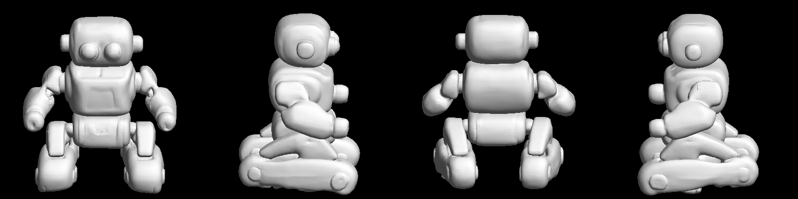
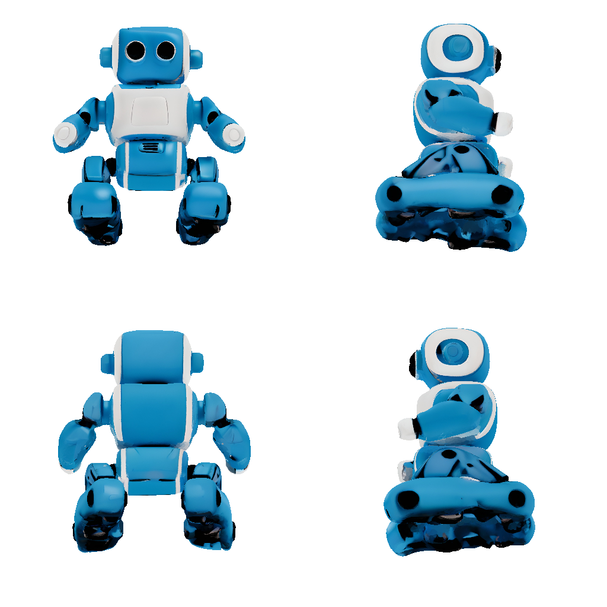

# hunyuan3d-strix-halo

[](https://github.com/kroqueta-s/hunyuan3d-strix-halo/actions/workflows/test.yml)

**[Hunyuan3D 2.1](https://github.com/Tencent-Hunyuan/Hunyuan3D-2.1) image-to-mesh
on AMD Strix Halo (gfx1151), Windows, ROCm — shape **and** texture.**

Upstream's shape stage runs on this hardware only after two changes made from
the launcher — never by editing upstream code:

1. **Scaled dot-product attention is handled at launch.** With
   `TORCH_ROCM_AOTRITON_ENABLE_EXPERIMENTAL=1` set before torch is imported
   (the runner does this), flash attention works on gfx1151 and is used as-is —
   measured 5× faster on the DiT than any fallback. Without it, the math
   backend materialises `q @ kᵀ` in fp16, overflows 65504 and turns the
   signed-distance field into noise; the runner then falls back to an fp32
   head-chunked replacement. The choice is made by measurement at startup and
   reported in `metrics.fast_attention`.
2. **`enable_flashvdm` is required.** The default volume decoder queries every
   point of a 385³ grid and does not finish in 30 minutes.

The **texture stage** (`install.ps1 -Texture`) needs more, because it ships two
compiled extensions and assumes a CUDA toolchain. Both are replaced by
pure-python equivalents that reproduce upstream's own procedure — a z-buffer
rasterizer ([`raster.py`](runners/hunyuan3d/raster.py)) and a UV hole-filler
([`inpaint.py`](runners/hunyuan3d/inpaint.py)) — so **nothing has to be
compiled**. The rest of what it takes is listed in
[`texture.py`](runners/hunyuan3d/texture.py).

The runner speaks one JSON object per line over stdin/stdout, so any
orchestrator can drive it as a child process —
[hearth](https://github.com/kroqueta-s/hearth) is one, built to hold this
runner and its siblings behind a single interface, one loaded at a time. It
also runs standalone (see Quickstart).

| Input image | Mesh (4 views) | Textured (4 views) |
|---|---|---|
|  |  |  |

*The bundled [`assets/sample.png`](assets/sample.png) (an SDXL-generated robot)
is the reference specimen for the measurements below. Both renders come from
this repository's own rasterizer, so they are also a check on it.*

## Prerequisites

- Windows 11
- Git
- An AMD GPU supported by ROCm on Windows (verified on **Strix Halo / gfx1151**,
  Radeon 8060S)
- A current AMD Adrenalin driver (verified with the 2026-08 driver; the
  **ROCm 10.0 runtime itself ships inside the wheels** that install.ps1 pins)
- **Python 3.12**
- ~20 GB of disk (venv + upstream clone + weights), ~31 GB with the texture stage
- ~15 GB of free VRAM at peak (~25 GB with the texture stage)

## Install

```powershell
git clone https://github.com/kroqueta-s/hunyuan3d-strix-halo
cd hunyuan3d-strix-halo
.\install.ps1
```

That creates a virtual environment, installs ROCm PyTorch, clones upstream at a
pinned commit, downloads the shape-stage weights (about 7.5 GB), writes `.env`,
and checks that the runner starts. If PowerShell refuses to run the script, use
`powershell -ExecutionPolicy Bypass -File .\install.ps1`.

Add `-Texture` to also install the texture stage. It costs about 11 GB more in
weights (the paint model plus DINOv2, which upstream requires) and takes tens of
minutes per bake, so it is opt-in:

```powershell
.\install.ps1 -Texture
```

## Quickstart

Generate a mesh from the bundled sample, no JSON required:

```powershell
.venv\Scripts\python.exe tools\run_single.py --image assets\sample.png --out C:\out
```

The mesh lands in `C:\out\raw.ply`. Progress streams to the console, with a bar
for every stage whose steps can be counted:

```
[   46.3s] shape      [############------------]  50%  (15/30)
[  318.6s] texture    [###########-------------]  46%  (7/15)
```

**The percentage is counted, never estimated**, and there is no ETA on purpose:
the same texture loop ran 167 s per step on its first run and 14.7 s per step
afterwards, so any prediction would mislead exactly when it mattered. Stages
whose length is not known report a step number and nothing more.

To reproduce the benchmark below, run the same command **twice and time the
second run**: the first run includes MIOpen's one-time kernel tuning, which says
nothing about steady-state speed.

## Use

```powershell
.venv\Scripts\python.exe -m runners.hunyuan3d
```

```json
{"id": 1, "method": "capabilities"}
{"id": 2, "method": "image_to_mesh", "params": {"image_path": "C:/in.png", "out_dir": "C:/out"}}
```

`image_to_mesh` writes `raw.ply` and `foreground.png`. Parameters: `steps`,
`octree_resolution`, `guidance_scale`, `seed`, `rembg`, `texture`.

With the texture stage installed there are two more ways in:

```json
{"id": 3, "method": "image_to_mesh", "params": {"image_path": "C:/in.png", "out_dir": "C:/out", "texture": true}}
{"id": 4, "method": "texture_mesh", "params": {"mesh_path": "C:/mesh.ply", "image_path": "C:/in.png", "out_dir": "C:/out"}}
```

Both write `textured.obj` with `textured.jpg` (albedo), `textured_metallic.jpg`
and `textured_roughness.jpg`. `texture_mesh` takes a mesh from anywhere — this
runner's own output, another generator, or a hand-made model.

**The textured mesh is not the detailed one.** Upstream decimates to 40,000
faces before unwrapping UVs, so `image_to_mesh` with `texture: true` writes both
`raw.ply` (full detail, untextured) and `textured.obj` (40,000 faces, textured).
The result reports the face count either way.

GLB is not written: upstream converts through `bpy` (Blender, GPL), which this
repository does not install. Convert downstream if you need it.

## Tests

Two stand-ins replace compiled extensions, so both are pinned by tests:

```powershell
.venv\Scripts\python.exe tests\test_raster.py    # the z-buffer rasterizer (needs torch)
.venv\Scripts\python.exe tests\test_inpaint.py   # the UV hole-filler (numpy only)
```

CI runs the second one; the first needs a GPU and runs here.

## Measurements (ASUS ProArt PX13: Ryzen AI MAX+ 395, Radeon 8060S / gfx1151, 32 GB dedicated VRAM, factory power limits)

One image (`assets/sample.png`), flash attention on, torch 2.13.0+rocm10.0.0
(the pins in `install.ps1`). The shape row is the **median of 5 runs** (each
a fresh process, reference GEMM and GPU clock recorded alongside every run),
2026-09-02:

| Stage | Load | Run | Peak VRAM | Output |
|---|--:|--:|--:|---|
| Shape, `steps=30`, `octree=384` (default) | 23 s | **73.1 s** (range 73.0–73.3) | 15.3 GB | 1,225,828 faces, watertight |
| Texture, 6 views at 512 px, 4096 px texture | 44 s | **220 s** | 24.6 GB | 40,000 faces, albedo + metallic + roughness |

The texture row is a single measurement from the previous wheel stack
(torch 2.9.1+rocm7.2.1), where the shape stage ran 86 s; the GEMM breakdown
and the update history are in [`docs/gemm_profile.md`](docs/gemm_profile.md).

Lowering `octree_resolution` opens holes (low-resolution marching cubes); do
not trade quality for speed here.

**The first texture bake takes far longer than the table says** — 2,509 s here
against 220 s afterwards. That is MIOpen tuning kernels once per machine, the
same one-time cost the shape stage pays. Time the second run, not the first.

A profile of where the shape stage's GPU time goes (GEMM shapes, attention) is
in [`docs/gemm_profile.md`](docs/gemm_profile.md), taken with
[`tools/profile_gemm.py`](tools/profile_gemm.py). Everything about this GPU
that does not depend on the model — GEMM baselines, clock behaviour, BLAS
backend switches — lives in
[gfx1151-gemm](https://github.com/kroqueta-s/gfx1151-gemm), shared by all
three runners in this family.

## Troubleshooting

- **Out of VRAM.** The runner caps torch at `HUNYUAN3D_VRAM_LIMIT_GB` (default
  30 GB) so that overflow fails fast as `torch.OutOfMemoryError` instead of
  silently spilling into shared memory and becoming several times slower. If
  you hit it, close other GPU consumers (check dedicated-VRAM usage in Task
  Manager's Performance tab); peak use for the defaults is about 12 GB.
- **Generation is ~4x slower when you are away.** If the console display
  turns off (lid, or the display-off timeout, locked or not), the driver
  pins the GPU near 600 MHz until it comes back
  ([details](https://github.com/kroqueta-s/gfx1151-gemm/blob/main/docs/displayoff.md)).
  Either keep the display from sleeping in Windows power settings, or set
  `HUNYUAN3D_DISPLAY_KEEPALIVE`=on to hold it awake during generation
  (off by default because it keeps the panel lit).
- **The first run looks hung.** It is not. MIOpen tunes kernels once per
  machine, with the GPU busy the whole time. Do not kill it; every later run
  reuses the tuned kernels. The runner emits a `heartbeat` line every 10 s —
  as long as those keep coming, it is working.

## Limits

- **The texture stage rewrites the geometry.** Upstream decimates to 40,000
  faces before unwrapping UVs, and that is upstream's design, not a setting.
  Keep `raw.ply` when the detail matters.
- **No GLB.** Upstream's converter imports `bpy` (Blender, GPL), which would
  cost this repository its MIT licence, so a stand-in is installed that imports
  cleanly and raises if called. The texture is written as `.obj` plus images.
- **The texture stage needs the network at install time only.** Upstream calls
  `snapshot_download` even when the weights are already on disk; the runner
  points that call back at the local copy, because unauthenticated hub
  downloads were seen stalling at zero bytes on this machine.
- **Background removal is not optional.** With a 3-channel image, upstream's
  `ImageProcessorV2.recenter()` sets the entire mask to 255, so the subject is
  never cropped. `rembg=False` means "I already removed the background", not
  "let the model handle it".
- **Smart App Control can block dependencies.** On 2026-09-01 it blocked
  `llvmlite.dll`, which broke `rembg → pymatting → numba → llvmlite`. The runner
  substitutes the unused part of `pymatting` when the real one cannot be
  imported. A freshly installed binary can also be blocked only briefly: retry
  once before concluding it is permanent. Disabling Smart App Control is
  irreversible and is not the answer.

## License

MIT (see [LICENSE](LICENSE)). Upstream Hunyuan3D 2.1 and its weights carry
Tencent's own licence — read it before commercial use. This repository contains
no upstream code and no weights.
